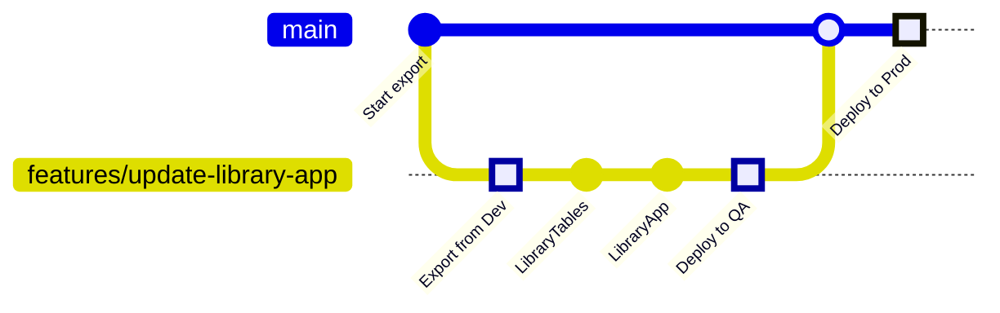

# Power Platform Demo - Solution Groups

This repository contains the configuration and metadata for Solution Groups and their associated Power Platform solutions. Solution Groups are used to organize and manage deployments and exports of related solutions with dependency management.

This implementation enables the following workflow:



## Overview

Two GitHub Actions workflows manage the Solution Groups:

1. **Deploy Solutions (Orchestrator)** (`DeploySolution.yml`) - Orchestrates sequential deployment of solutions to QA or Production environments
2. **Export Solutions (Orchestrator)** (`ExportSolution.yml`) - Orchestrates sequential export of solutions from Development environment

Both workflows support **dependency/sequential processing**, allowing automatic export or deployment of dependent solutions in the correct order.

Implementation uses
[Power Platform Actions](https://github.com/microsoft/powerplatform-actions/)
for automations.

## Directory Structure

Here are the most important files and directories from our example repository:

```
SolutionGroups/
├── solution-groups.json          # Dependency mapping configuration
├── Library/                      # Solution Group "Library"
│   ├── LibraryTables.zip         # LibraryTables managed solution
│   ├── LibraryApp.zip            # LibraryApp managed solution
│   └── ...
└── MyVacations/                  # Solution Group "MyVacations"
    ├── MyVacationsTables.zip     # MyVacationsTables managed solution
    ├── MyVacationsApp.zip        # MyVacationsApp managed solution
    └── ...
```

Folder structure has both managed (.zip) and unmanaged (_unmanaged.zip) solution files, along with metadata (.md) files for each application.

## Configuration File: solution-groups.json

The `solution-groups.json` file defines the deployment order for applications within each Solution Group as an array.

**Structure:**
```json
{
    "<SolutionGroupName>": [
        "FirstApp",
        "SecondApp",
        "ThirdApp"
    ]
}
```

**Example Configuration:**
```json
{
    "Library": [
        "LibraryTables",
        "LibraryApp"
    ],
    "MyVacations": [
        "MyVacationsTables",
        "MyVacationsApp"
    ]
}
```

This means:
- Apps are deployed/exported in the order they appear in the array
- When cascading is enabled, apps are processed sequentially (one after another)
- "LibraryTables" is deployed/exported first, then "LibraryApp"

**Note:** The app names in `solution-groups.json` should **not** include number prefixes. The dropdown options in the workflows can include numbers for ordering (e.g., "1. LibraryTables"), but the JSON file uses the base app name without numbers.

## Workflows

### 1. Deploy Solution Workflow

**File:** `.github/workflows/DeploySolution.yml`

**Purpose:** Deploy applications and display their configuration

**Triggers:**
- **Manual (workflow_dispatch):** Select a solution from dropdown and run manually
- **Automatic (pull_request):** Triggered automatically when `*_unmanaged.zip` files are changed in the `SolutionGroups/` directory

**Features:**
- Select a solution from dropdown (e.g., "Library -> 1. LibraryTables") for manual deployment
- Auto-detects solution from PR changes when triggered by pull request
- Deploys solutions to the specified environment
- Optionally deploys dependencies (subsequent solutions in the group)
- Uses the branch/tag selected in GitHub Actions UI

**Manual Usage:**
1. Go to Actions → "Deploy Solutions (Orchestrator)"
2. Click "Run workflow"
3. Select the solution to deploy (e.g., "Library -> 1. LibraryTables")
4. Select the target environment (QA or Production)
5. Check "Deploy dependencies?" to enable sequential deployment of remaining solutions
6. Click "Run workflow"

**Automatic Usage (QA Deployment):**
- When a pull request modifies any file in the `SolutionGroups/` directory (except `.github/workflows/**` and `solution-groups.json`), the workflow automatically triggers
- The workflow detects all `*_unmanaged.zip` files changed in the PR
- Solutions are deployed in the order defined in `solution-groups.json`
- Example: PR with changes to `SolutionGroups/Library/LibraryTables_unmanaged.zip` and `SolutionGroups/Library/LibraryApp_unmanaged.zip` → deploys both in correct order

**Automatic Usage (Production Deployment):**
- When changes are pushed to the `main` branch (typically after merging a PR), the workflow automatically triggers
- The workflow detects all `*_unmanaged.zip` files changed in the commit
- Solutions are deployed sequentially to Production in the order defined in `solution-groups.json`

**Example Flow (Manual with Dependencies):**
- Deploy "Library -> 1. LibraryTables" to QA with "Deploy dependencies?" enabled
  - Deploys LibraryTables to QA
  - Automatically deploys LibraryApp to QA (next in sequence)

**Note:** The workflows support numbered app names in the dropdown (e.g., "1. LibraryTables", "2. LibraryApp") to make ordering clear in the UI. The processing logic automatically removes these number prefixes when matching against `solution-groups.json`.

Here are screenshots of the workflows in action:

Initiate deployment of LibraryTables which has the following configuration:

```json
{
  "Library": [
    "LibraryTables",
    "LibraryApp"
  ]
}
```

When "Trigger dependent workflows" is enabled, it will deploy LibraryTables first, then automatically trigger LibraryApp.

### 2. Export Solution Workflow

**File:** `.github/workflows/ExportSolution.yml`

**Purpose:** Update application metadata and commit changes

**Features:**
- Exports both managed and unmanaged solution files (.zip)
- Creates metadata `.md` files with export timestamp, actor, and workflow run link
- Supports custom branch selection for exports
- Automatically creates the specified branch if it doesn't exist (or generates timestamped branch name)
- Optionally exports dependencies (subsequent solutions in the group)
- Automatically creates a pull request after exports complete
- Triggers QA deployment workflow after PR creation
- Creates an audit trail of export activities

**Usage:**
1. Go to Actions → "Export Solutions (Orchestrator)"
2. Click "Run workflow"
3. Select the solution to export (e.g., "Library -> 1. LibraryTables")
4. Enter a branch name (optional)
   - Leave empty for auto-generated name with timestamp (e.g., "features/export-solution-20250428-143022")
   - If the branch exists, it will be used
   - If it doesn't exist, it will be created
   - **Cannot be "main" or "master"** (protected branches)
5. Check "Export dependencies?" to enable sequential export of remaining solutions
6. Click "Run workflow"

**What happens:**
- The workflow creates or checks out the specified branch
- For each solution to export:
  - Exports managed solution (.zip file)
  - Exports unmanaged solution (_unmanaged.zip file)
  - Creates metadata file (.md file)
  - Commits changes to the branch
- If "Export dependencies?" is enabled, subsequent solutions are also exported to the same branch
- After all exports complete:
  - Automatically creates a pull request (or updates existing PR)
  - Triggers the Deploy Solutions workflow to deploy to QA environment

**Note:** The workflows support numbered app names in the dropdown to make ordering clear in the UI. The processing logic automatically removes these number prefixes.

### Benefits

- **Isolation**: Keep exports separate from other work
- **Review**: Review all exported changes in a PR before merging
- **History**: Clear branch history showing what was exported and when
- **Safety**: No direct commits to main branch (enforced by validation)
- **Protection**: main and master branches are protected from direct exports
- **Auto-timestamping**: Leave branch name empty for automatic timestamp-based branch names

## Adding a New Solution Group

Follow these steps to add a new Solution Group (e.g., "Benefits"):

### Step 1: Create the Directory Structure

```powershell
# Create the solution group directory
mkdir SolutionGroups\Benefits
```

### Step 2: Update solution-groups.json

Add the new solution group to `SolutionGroups/solution-groups.json`:

```json
{
    "Library": [
        "LibraryTables",
        "LibraryApp"
    ],
    "MyVacations": [
        "MyVacationsTables",
        "MyVacationsApp"
    ],
    "Benefits": [
        "BenefitsTables",
        "BenefitsApp"
    ]
}
```

**Note:** Solutions are listed in deployment order. When "Deploy/Export dependencies?" is enabled, they will be processed sequentially in this order. In this example, BenefitsTables must be deployed before BenefitsApp.

### Step 3: Update Workflow Files

Update **both** workflow files to include the new solution group options:

**Files to update:**
- `.github/workflows/DeploySolution.yml`
- `.github/workflows/ExportSolution.yml`

**Add these lines to the `options` section under `inputs.solution`:**

```yaml
on:
  workflow_dispatch:
    inputs:
      solution:
        description: 'Solution to export' # or 'Solution to deploy'
        required: true
        type: choice
        options:
          - 'Library -> 1. LibraryTables'
          - 'Library -> 2. LibraryApp'
          - 'MyVacations -> 1. MyVacationsTables'
          - 'MyVacations -> 2. MyVacationsApp'
          - 'Benefits -> 1. BenefitsTables'
          - 'Benefits -> 2. BenefitsApp'
```

**Note:** Number prefixes (e.g., "1.", "2.") help users understand the dependency order in the UI. The workflows automatically strip these prefixes when processing. The numbers reflect the sequential deployment/export order defined in `solution-groups.json`.

### Step 4: Create Solutions in Power Platform

Before running the export workflow, ensure the solutions exist in your Power Platform Development environment:

1. Create "BenefitsTables" solution with tables/data entities
2. Create "BenefitsApp" solution with apps/flows that depend on BenefitsTables

### Step 5: Run Export Workflow

1. Go to GitHub Actions → "Export Solutions (Orchestrator)"
2. Select: "Benefits -> 1. BenefitsTables"
3. Branch name: features/benefits-initial-export
4. Check "Export dependencies?" to also export BenefitsApp
5. Click "Run workflow"

This will:
- Export BenefitsTables (managed and unmanaged .zip files)
- Export BenefitsApp (managed and unmanaged .zip files)
- Create metadata .md files with export details
- Create all files in `SolutionGroups/Benefits/` directory
- Commit changes to the branch
- Create a pull request
- Trigger QA deployment

### Step 6: Verify and Merge

Review the created PR with exported solution files:

- SolutionGroups/Benefits/BenefitsTables.zip
- SolutionGroups/Benefits/BenefitsTables_unmanaged.zip
- SolutionGroups/Benefits/BenefitsTables.md
- SolutionGroups/Benefits/BenefitsApp.zip
- SolutionGroups/Benefits/BenefitsApp_unmanaged.zip
- SolutionGroups/Benefits/BenefitsApp.md

Merge the PR to trigger Production deployment.

## Adding a New App to an Existing Solution Group

Follow these steps to add a new application to an existing Solution Group:

### Step 1: Update solution-groups.json

Add the new app to the appropriate solution group in `SolutionGroups/solution-groups.json`:

**Before:**
```json
{
    "Library": [
        "LibraryTables",
        "LibraryApp"
    ]
}
```

**After:**
```json
{
    "Library": [
        "LibraryTables",
        "LibraryApp",
        "LibraryReports"
    ]
}
```

**Note:** The position in the array determines the deployment order. "LibraryReports" will be deployed/exported after "LibraryApp" when dependencies are enabled.

### Step 2: Update Workflow Files

Update **both** workflow files:

**Files to update:**
- `.github/workflows/DeploySolution.yml`
- `.github/workflows/ExportSolution.yml`

**Add the new option to the `inputs.solution.options` section:**

```yaml
options:
  - 'Library -> 1. LibraryTables'
  - 'Library -> 2. LibraryApp'
  - 'Library -> 3. LibraryReports'
  - 'MyVacations -> 1. MyVacationsTables'
  - 'MyVacations -> 2. MyVacationsApp'
```

**Note:** Number prefixes indicate ordering in the UI. The workflows automatically strip these prefixes when processing.

### Step 3: Create Solution in Power Platform

Ensure the "LibraryReports" solution exists in your Power Platform Development environment before exporting.

### Step 4: Run Export Workflow

1. Go to GitHub Actions → "Export Solutions (Orchestrator)"
2. Select: "Library -> 3. LibraryReports"
3. Branch name: features/add-library-reports
4. Click "Run workflow"

This will automatically create all required files:

- `SolutionGroups/Library/LibraryReports.zip` (managed solution)
- `SolutionGroups/Library/LibraryReports_unmanaged.zip` (unmanaged solution)
- `SolutionGroups/Library/LibraryReports.md` (metadata with export details)

### Step 5: Review and Merge

The export workflow will:
- Create/update the PR with the new solution files
- Automatically trigger QA deployment
- Enable Production deployment on merge

## Dependency Management

### Understanding Dependencies

Dependencies are defined as **one-way relationships** in `solution-groups.json`:

- **Parent App** → **Dependent Apps** (children)
- When you deploy/extract a parent app with cascading enabled, all dependent apps are processed automatically

### Automatic Deployment via Pull Requests

The Deploy Solutions workflow is automatically triggered when solution files are modified:

**QA Deployment (Pull Request):**
1. **Export Solutions**: Run the Export Solutions workflow to export from Development environment
2. **Automatic PR Creation**: The export workflow automatically creates a pull request
3. **Automatic QA Trigger**: The export workflow triggers the Deploy Solutions workflow
4. **Auto-Detection**: The workflow detects all `*_unmanaged.zip` files changed in the PR
5. **Ordered Deployment**: Solutions are deployed to QA in the order defined in `solution-groups.json`

**Production Deployment (Merge to Main):**
1. **Merge PR**: Review and merge the pull request to the `main` branch
2. **Automatic Trigger**: The Deploy Solutions workflow automatically runs on push to main
3. **Auto-Detection**: The workflow detects all `*_unmanaged.zip` files changed in the commit
4. **Ordered Deployment**: Solutions are deployed to Production in the order defined in `solution-groups.json`

**Benefits:**
- Fully automated CI/CD pipeline from export to production
- Consistent deployment process for both QA and Production
- Clear audit trail through pull request history
- Dependency order automatically maintained

## Troubleshooting

### Workflow fails with "Solution not found in Power Platform"
- Verify the solution exists in the Development environment
- Check that the solution name in `solution-groups.json` exactly matches the Power Platform solution name
- Ensure the Power Platform connection credentials are valid

### New solution doesn't appear in dropdown
- Ensure you updated **both** workflow files:
  - `.github/workflows/DeploySolution.yml`
  - `.github/workflows/ExportSolution.yml`
- Add the solution option with the correct format: `'SolutionGroup -> 1. SolutionName'`
- Commit and push the workflow changes
- Refresh the Actions page in GitHub

### Deployment order is incorrect
- Verify the order in `solution-groups.json` matches your dependency requirements
- Solutions are deployed in array order (top to bottom)
- Foundation solutions (tables) should be listed before apps that depend on them
