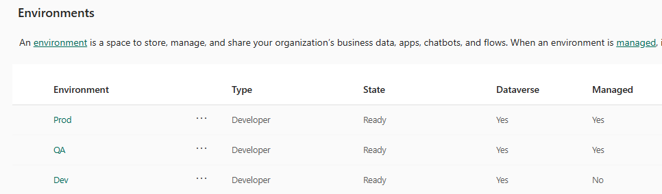
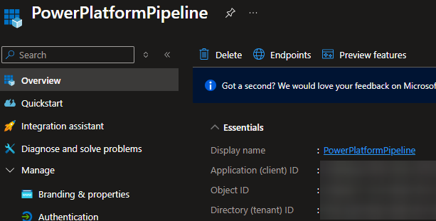
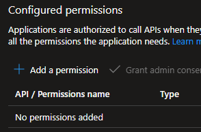
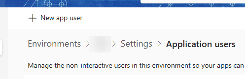
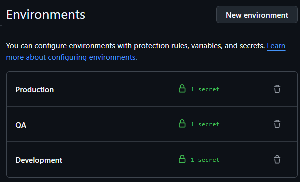
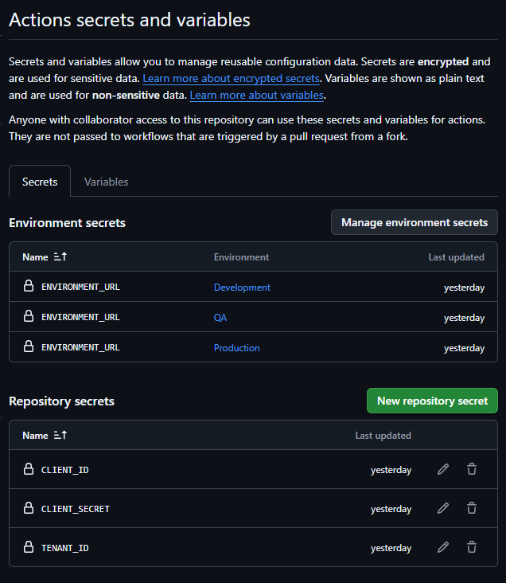

# Documentation

## Background links

[Tutorial: Get started with GitHub Actions for Microsoft Power Platform](https://learn.microsoft.com/en-us/power-platform/alm/tutorials/github-actions-start)

[Create an application user](https://learn.microsoft.com/en-us/power-platform/admin/manage-application-users?tabs=new#create-an-application-user)

## Prerequisites

Power Platform environment(s):

> [!NOTE]
> Note: Capture the environment URL(s) for later use.

Service principal with appropriate permissions in the target environment(s):

You need to capture the following values from the service principal registration:

- Application (client) ID
- Directory (tenant) ID
- Client secret (you need to create one if not already available)

> [!NOTE]
> Note: No API permissions are needed for this scenario:

Assign the service principal as an application user in the target Power Platform environment(s) with the necessary permissions:

GitHub environments configured with the necessary secrets:

> [!IMPORTANT]
> Note: You can have **application users** per environment or use the **same application user** across multiple environments.

Allow GitHub Actions to trigger workflows:

Here's an example GitHub secret configuration:

| Secret Name                 | Description                                      |
| --------------------------- | ------------------------------------------------ |
| CLIENT_ID                   | Application (client) ID of the service principal |
| TENANT_ID                   | Directory (tenant) ID of the service principal   |
| CLIENT_SECRET               | Client secret of the service principal           |
| ENVIRONMENT_URL             | URL of the target Power Platform environment     |
