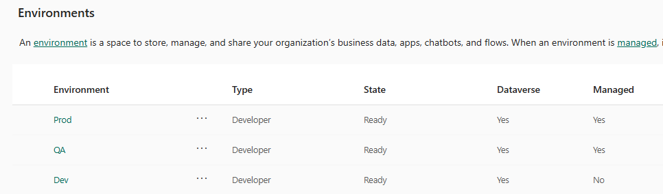
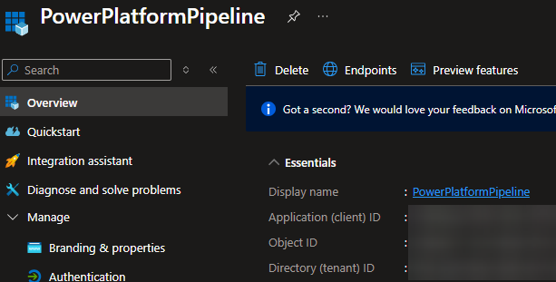
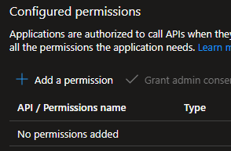
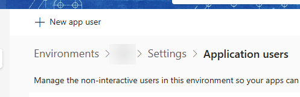
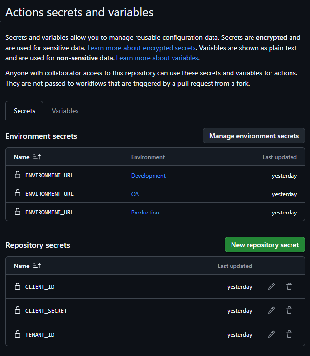
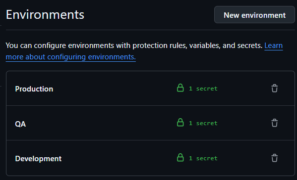

# Documentation

## Background links

[Tutorial: Get started with GitHub Actions for Microsoft Power Platform](https://learn.microsoft.com/en-us/power-platform/alm/tutorials/github-actions-start)

[Create an application user](https://learn.microsoft.com/en-us/power-platform/admin/manage-application-users?tabs=new#create-an-application-user)

## Prerequisites

Power Platform [environment(s)](https://admin.powerplatform.microsoft.com/manage/environments):



> [!NOTE]
> Note: Capture the environment URL(s) for later use.

Service principal with appropriate permissions in the target environment(s):



You need to capture the following values from the service principal registration:

- Application (client) ID
- Directory (tenant) ID
- Client secret (you need to create one if not already available)

> [!NOTE]
> Note: No API permissions are needed for this scenario:



Assign the service principal as an application user in the target Power Platform environment(s) with the necessary permissions:



> [!IMPORTANT]
> Note: You can have **application users** per environment or use the **same application user** across multiple environments.

Allow GitHub Actions to trigger workflows:


Here's an example GitHub secret configuration:



GitHub environments configured with the necessary secrets:



| Secret Name     | Description                                      | Example                              |
| --------------- | ------------------------------------------------ | ------------------------------------ |
| CLIENT_ID       | Application (client) ID of the service principal | 5248da5b-8afb-4382-a037-5196daebac55 |
| TENANT_ID       | Directory (tenant) ID of the service principal   | 6f6b9051-7e7c-4b41-bc5e-bf027ce1951f |
| CLIENT_SECRET   | Client secret of the service principal           | `auto-generated-password`            |
| ENVIRONMENT_URL | URL of the target Power Platform environment     | https://org2f3b2369.crm.dynamics.com |

## Environment URL Overrides

The `ENVIRONMENT_URL` secret is the default target for all deployments. You can override it per solution group and per environment using the `Configurations` section in `SolutionGroups/solution-groups.json`.

Example — deploy the `Library` group to a different QA environment:

```json
{
    "Library": {
        "Configurations": {
            "QA": {
                "Environment": "https://org123456.crm.dynamics.com/"
            }
        },
        "Solutions": [
            "LibraryTables",
            "LibraryApp"
        ]
    }
}
```

When a `Configurations.<environment>.Environment` value is present, the deployment workflow uses it instead of `secrets.ENVIRONMENT_URL`. If no override is defined, the secret is used as before.
